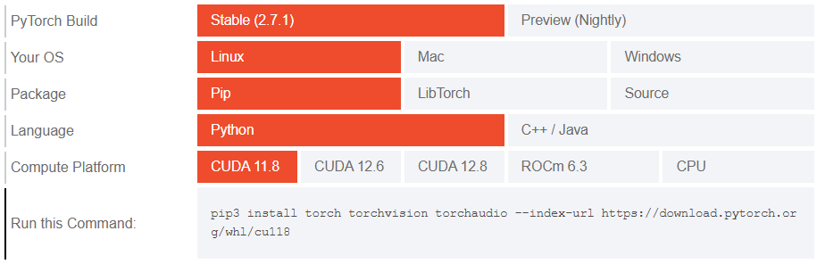

## anaconda安装

1.

服务器默认安装了anaconda3，无需重复安装。

### anaconda环境创建

#### 1.创建环境：

```shell
conda create --name <my-env>
```

将`<my-env>`替换为你的环境名。

2.创建特定Python版本的环境：

```shell
conda create --name <my-env> python=<version>
```

将`<version>`替换为需要的python版本号。

> 新版本的anaconda在创建环境时不会自动安装python等工具包，若发现创建环境后vscode或其他IDE无法识别到环境，请使用第2种方法创建环境，或者激活环境后手动安装python

### 激活环境

```shell
conda activate <my-env>
```

### 安装Pytorch

进入Pytorch官网：https://pytorch.org/get-started/locally/ ，选择`Stable`、`Linux`、`Pip`、`Python`、`CUDA11.8`选项后，复制下方的命令并粘贴，如图所示



```shell
pip3 install torch torchvision torchaudio --index-url https://download.pytorch.org/whl/cu118
```

等待片刻后即可完成Pytorch的安装。

## 其它补充

## 参考链接

anaconda：https://www.anaconda.com/docs/tools/working-with-conda/environments

Pytorch：https://pytorch.org/get-started/locally/