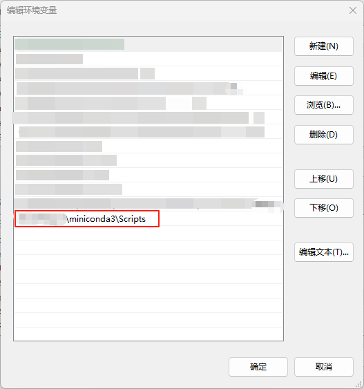

## anaconda安装

进入[anaconda下载页面](https://www.anaconda.com/download/success)下载对应版本的anaconda或miniconda安装包，以下以miniconda的安装为例。

### Windows下miniconda安装

1.进入下载页面下载安装包。

2.启动安装程序。

3.安装选项建议选择“All users”，为所有用户安装。

4.将miniconda安装目录下的`Scripts`文件夹添加至系统环境变量。



5.打开windows终端，输入`conda init`后回车，再输入`conda config --set auto_activate_base false`取消环境自启动。

### Linux下anaconda安装

服务器默认安装了anaconda3，无需重复安装。如有需要，可参考以下步骤安装miniconda。

1.输入以下命令获取最新安装脚本

```shell
wget https://repo.anaconda.com/miniconda/Miniconda3-latest-Linux-x86_64.sh
```

2.运行安装脚本

```shell
bash ~/Miniconda3-latest-Linux-x86_64.sh
```

3.输入`yes`同意协议

4.按回车键选择默认安装位置

5.输入`yes`自动初始化终端。

6.重启终端，输入`conda config --set auto_activate_base false`取消环境自启动。

## anaconda环境创建

1.创建环境：

```shell
conda create --name <my-env>
```

将`<my-env>`替换为你的环境名。

2.创建特定Python版本的环境：

```shell
conda create --name <my-env> python=<version>
```

将`<version>`替换为需要的python版本号。

!!!warning 新版本的anaconda在创建环境时不会自动安装python等工具包，若发现创建环境后vscode或其他IDE无法识别到环境，请使用第2种方法创建环境，或者激活环境后手动安装python

3.激活环境：

```shell
conda activate <my-env>
```

## 安装Pytorch

进入Pytorch官网：https://pytorch.org/get-started/locally/ ，选择`Stable`、`Linux`、`Pip`、`Python`、`CUDA11.8`选项后，复制下方的命令并粘贴，如图所示


```shell
pip3 install torch torchvision torchaudio --index-url https://download.pytorch.org/whl/cu118
```

等待片刻后即可完成Pytorch的安装。

## 其它补充

To be updated.

## 参考链接

anaconda：[https://www.anaconda.com/docs/tools/working-with-conda/environments](https://www.anaconda.com/docs/tools/working-with-conda/environments)

Pytorch：[https://pytorch.org/get-started/locally/](https://pytorch.org/get-started/locally/)