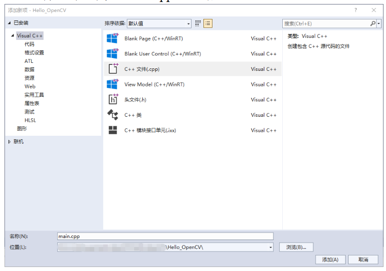
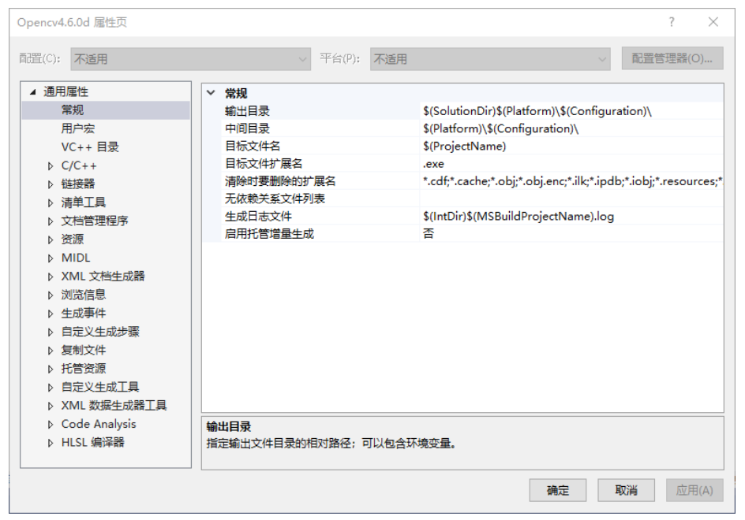
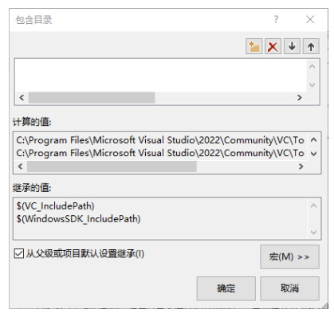
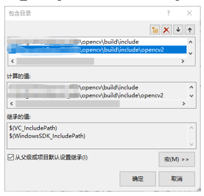
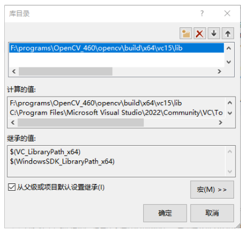
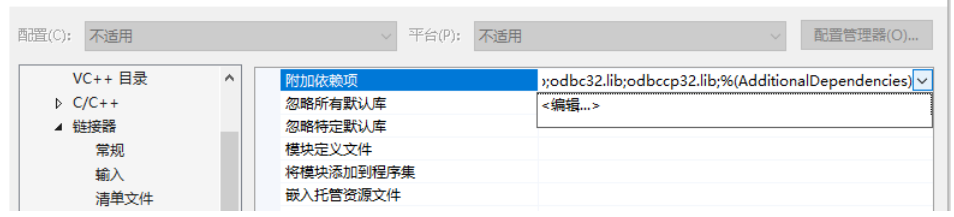

## 安装VS

进入[VS下载页面](https://visualstudio.microsoft.com/zh-hans/downloads/)，下载VS的Community版本，下载完成后安装即可，注意需要勾选C++桌面开发。


## 下载OpenCV

进入OpenCV官网的[下载页面](https://opencv.org/releases/)，选择Windows选项下载。


双击下载完成后的文件，设置合适路径后点击Extract。

## 配置环境变量

将上一步选择的路径下的`<path_to_opencv>\opencv\build\x64\vc16\bin`文件夹加入系统的环境变量中。


## 新建项目

1.打开VS，点击创建新项目。


2.选择空项目，点击下一步。


3.为项目命名并选择合适路径后点击创建。


4.创建完成后右键项目名称$\rightarrow$“添加”$\rightarrow$“新建项”。


5.选择C++文件，命名为`main.cpp`，然后点击添加。



## 创建属性表

1.打开属性管理器。


2.在打开的属性管理器中，右键“Debug|x64”$\rightarrow$“添加新的属性表”。名称改为“Opencv4.11.0.d.props”，后缀d表示Debug模式。


3.双击“Debug|x64”下的“Opencv4.11.0d”，出现如下图所示的属性页面。



4.点击“VC++目录”$\rightarrow$“包含目录”$\rightarrow$点击右侧小三角$\rightarrow$“编辑”，添加包含目录。

5.点击右侧文件夹符号。



6.添加OpenCV安装文件夹下的两个路径`<path_to_opencv>\opencv\build\include`和`<path_to_opencv>\opencv\build\include\opencv2`。



7.点击“VC++目录”$\rightarrow$“库目录”$\rightarrow$点击右侧小三角$\rightarrow$“编辑”，添加`<path_to_opencv>\opencv\build\x64\vc16\lib`路径。



8.点击“链接器”$\rightarrow$“输入”$\rightarrow$点击右侧小三角$\rightarrow$“编辑”，添加`opencv_world4110d.lib`。



9.若在Release模式下，其他步骤完全一致，最后一步添加依赖项时输入`opencv_world4110.lib`，无`d`后缀。

10.在属性管理器中右键“Opencv4.11.0d”后保存属性表，后续新建项目时只需要导入即可。

## 测试程序

```cpp
#include<opencv2/opencv.hpp>
#include<iostream>

using namespace cv;

int main()
{
    // Read local image
    // The file path following imread can be modified according to your actual path
    Mat img = imread("image.png");

    // Display image
    imshow("img", img);

    // Wait
    waitKey(0);
    return 0;
}
```

编译程序，如果可以成功显示图片，则配置成功。