## 下载与安装

### 下载、安装VS

进入[VS下载页面](https://visualstudio.microsoft.com/zh-hans/downloads/)，下载VS的Community版本，下载完成后安装即可，注意需要勾选C++桌面开发。


### 下载OpenCV

进入OpenCV官网的[下载页面](https://opencv.org/releases/)，选择Sources选项下载。下载完成后解压压缩包至合适的文件夹中。

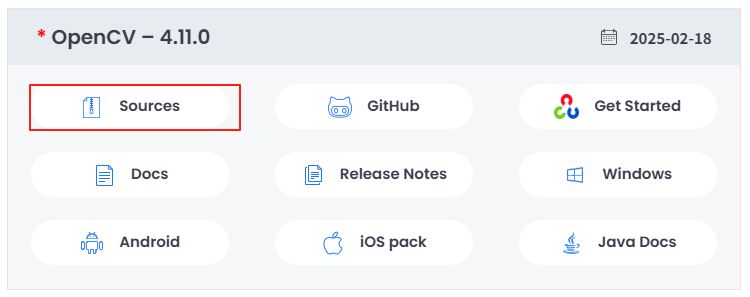

### 下载Cmake

进入[Cmake下载页面](https://cmake.org/download/)，选择“Windows x64 Installer选项”，下载Cmake安装包。

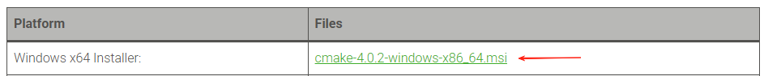

### 配置Cmake环境变量

将Cmake安装路径内的`bin\`{: .filename}文件夹添加至系统环境变量。

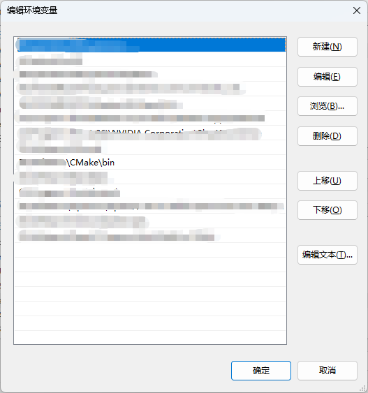

### 编译OpenCV

1.打开Cmake(cmake-gui)，点击`Browse Source...`按钮，选择解压后的文件夹，该文件夹下应包含有如下的文件夹。

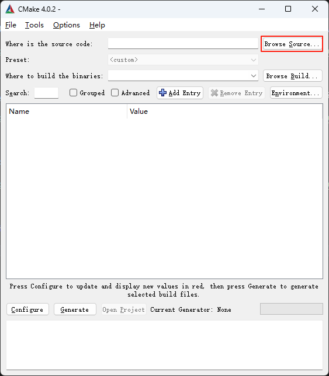


2.点击`Browse Build...`按钮，自行选择合适的编译路径，示例：`D:/Downloads/build`{: .filepath}。

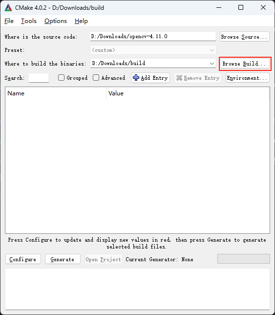

3.点击`Tools`→`Configure`，调整弹出窗口的选项如下图所示，然后点击Finish

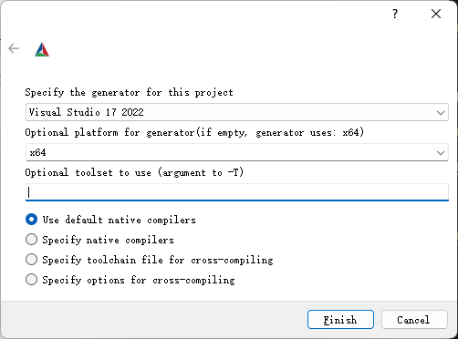

4.等待CMake配置完成后，点击`Configure`按钮，等待片刻后，在搜索框内搜索`OPENCV_GENERATE_SETUPVARS`去除`Value`下方的勾。

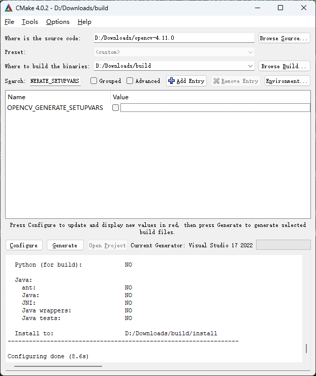

5.搜索`opencv_world`并勾选。

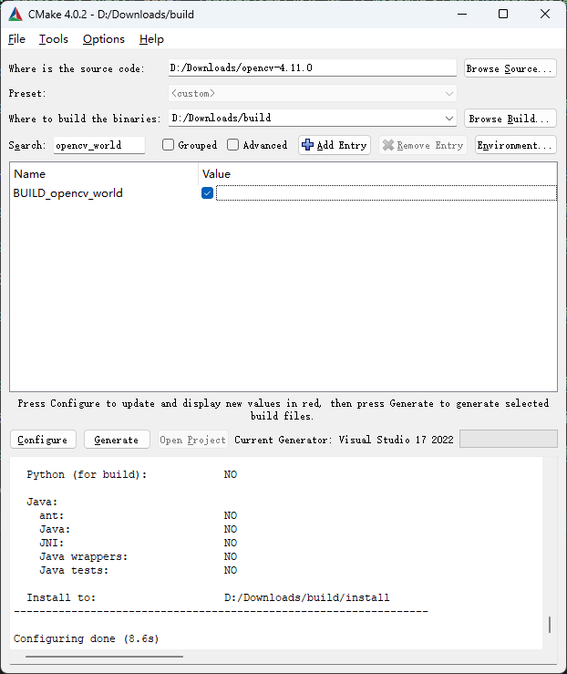

6.点击`Configure`选项开始配置。配置完成后，若无报错，点击`Generate`。

7.点击`Open Project`，启动VS，或者在上述创建的`build`{: .filepath}文件夹中找到`Opencv.sln`{: .filepath}项目用VS启动。

8.选择`Build`→`Build Solution`。

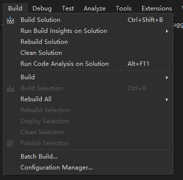

9.生成完成后，在“资源管理器”中右键“CmakeTargets”下的“INSTALL”选项，选择`Project Only`→`Build Only INSTALL`。

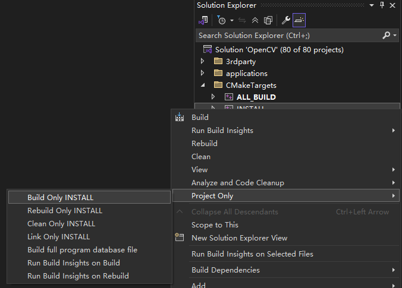

10.上一步完成后，在上述创建的`build`{: .filepath}文件夹中会生成一个`install`{: .filepath}文件夹，这个目录下的文件就是我们需要的，可以将其复制到合适的文件夹下，再将其中的`x64\vc17\bin`{: .filepath}目录添加到系统环境变量。

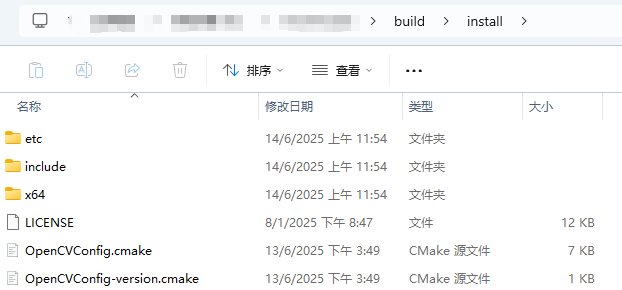

## 环境测试

1.创建新项目，新建一个`CMakeLists.txt`{: .filepath}和`main.cpp`{: .filepath}文件，以下使用VS Code示范。

```cmake
# CMakeLists.txt
cmake_minimum_required(VERSION 3.30)

project(OpenCVDemo VERSION 0.1 LANGUAGES CXX)

set(CMAKE_CXX_STANDARD 17)
set(CMAKE_CXX_STANDARD_REQUIRED ON)
set(EXECUTABLE_OUTPUT_PATH ${CMAKE_SOURCE_DIR}/bin)

set(OpenCV_DIR "D:/Software/OpenCV/OpenCV-VC17-Build-OpenCV-4.11.0-x64")
find_package(OpenCV REQUIRED)

add_executable(${PROJECT_NAME} main.cpp)

target_link_libraries(${PROJECT_NAME} PRIVATE ${OpenCV_LIBS})
```

```cpp
// main.cpp
#include <opencv2/opencv.hpp>
#include <iostream>

using namespace cv;

int main()
{
    // Read local image
    // The file path following imread can be modified according to your actual path
    Mat img = imread("image.png");

    // Display image
    imshow("img", img);

    // Wait
    waitKey(0);
    return 0;
}
```

2.运行结果

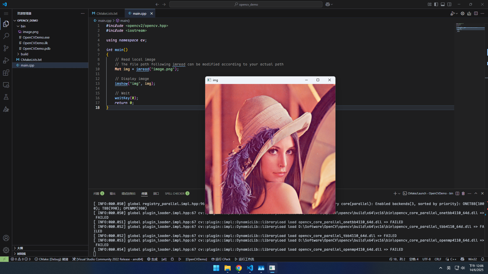

## 补充

若编译失败，可在[此链接](https://drive.google.com/drive/folders/1MWTSMbz9gFhNqlyWecARt_utOnzHNpss?usp=sharing)下载已编译好的OpenCV包。

## 参考链接

知乎：[https://zhuanlan.zhihu.com/p/620479751](https://zhuanlan.zhihu.com/p/620479751)